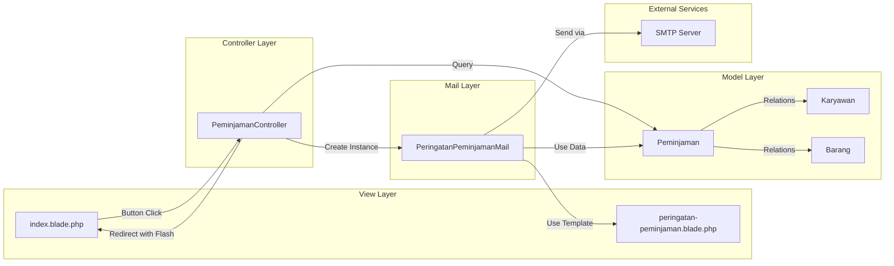
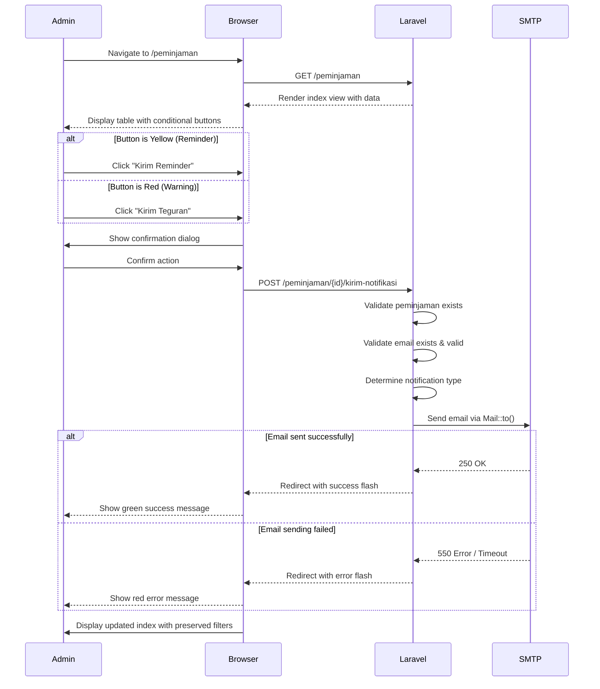

# Design Document: Kirim Email Notifikasi Manual

## Overview

Fitur **Kirim Email Notifikasi Manual** memungkinkan administrator untuk mengirim email pengingat (reminder) atau teguran (warning) kepada karyawan yang meminjam aset IT melalui tombol aksi di halaman daftar peminjaman. Sistem akan menampilkan tombol secara conditional berdasarkan status peminjaman dan selisih waktu dengan tanggal pengembalian yang direncanakan.

### Key Features
- **Conditional Button Rendering**: Tombol muncul berdasarkan status peminjaman dan time difference
- **Dual Notification Types**: Reminder (H-1/H-0) dan Warning (terlambat)
- **Email dengan Branding**: Template email dengan header PT. Bukit Makmur Mandiri Utama
- **User Feedback**: Flash messages dengan state preservation (filter, pagination)
- **Validation**: Multi-layer validation untuk data integrity

### Technical Context
- **Framework**: Laravel 10.x
- **Architecture Pattern**: MVC
- **Email System**: Laravel Mail + Mailable
- **View Engine**: Blade Template dengan Tailwind CSS
- **Database**: MySQL (existing peminjamans, karyawans, barangs tables)

## Architecture


### High-Level Architecture Diagram

```mermaid
graph TD
    A[Administrator] -->|Views Index Page| B[peminjaman.index View]
    B -->|Renders Conditional Button| C{Button Logic}
    C -->|Status=Kembali| D[Hide Button]
    C -->|Dipinjam & >24h| D
    C -->|Dipinjam & 0-24h| E[Show Yellow Reminder Button]
    C -->|Terlambat| F[Show Red Warning Button]
    
    E -->|Click| G[POST /peminjaman/{id}/kirim-notifikasi]
    F -->|Click| G
    
    G -->|Routes to| H[PeminjamanController::kirimNotifikasi]
    H -->|Validates| I{Validation Checks}
    I -->|Peminjaman Not Found| J[Redirect with Error]
    I -->|Email Missing/Invalid| J
    I -->|Date Mismatch| J
    I -->|Valid| K[Determine Notification Type]
    
    K -->|Type = Reminder/Warning| L[PeringatanPeminjamanMail]
    L -->|Mail::to| M[SMTP Server]
    M -->|Success| N[Redirect with Success Flash]
    M -->|Fail| O[Redirect with Error Flash]
    
    N -->|Preserve State| P[Back to Index with Filters]
    O -->|Preserve State| P
    
    style E fill:#fcd34d
    style F fill:#ef4444
    style N fill:#86efac
    style O fill:#fca5a5
```


### Component Diagram



### Data Flow


1. **Administrator** membuka halaman `/peminjaman` (index)
2. **View** melakukan iterasi pada collection `$peminjamans`
3. Untuk setiap `$peminjaman`, **View Logic** menghitung:
   - Status peminjaman
   - Time difference menggunakan `Carbon::parse()->diffInHours()`
4. **Conditional Rendering**:
   - Jika kondisi terpenuhi → render button dengan warna dan text sesuai
   - Jika tidak → skip rendering button
5. **Administrator** meng-klik button
6. **Browser** mengirim POST request ke `/peminjaman/{id}/kirim-notifikasi`
7. **Router** meneruskan ke `PeminjamanController::kirimNotifikasi()`
8. **Controller** melakukan validation cascade:
   - Check peminjaman exists
   - Check karyawan email exists & valid
   - Check date logic (reminder vs warning)
9. **Controller** membuat instance `PeringatanPeminjamanMail` dengan data peminjaman dan tipe notifikasi
10. **Mail Facade** mengirim email via SMTP
11. **Controller** redirect back dengan flash message dan preserve query parameters
12. **View** menampilkan flash message


## Components and Interfaces

### 1. View Component: Button Rendering Logic

**Location**: `resources/views/peminjaman/index.blade.php`

**Purpose**: Menampilkan tombol aksi secara conditional di kolom "Aksi" tabel peminjaman

**Pseudocode**:

```blade
{{-- Inside table foreach loop --}}
@php
    $status = $peminjaman->status_peminjaman;
    $returnDate = $peminjaman->tanggal_kembali_rencana;
    $currentDate = now();
    
    // Calculate time difference in hours
    $diffInHours = null;
    if ($returnDate) {
        $diffInHours = \Carbon\Carbon::parse($returnDate)->diffInHours($currentDate, false);
    }
    
    // Determine button state
    $showButton = false;
    $buttonClass = '';
    $buttonText = '';
    
    if ($status && $returnDate && $status !== 'Kembali') {
        if ($status === 'Terlambat' || $currentDate->gt($returnDate)) {
            // Show red warning button
            $showButton = true;
            $buttonClass = 'bg-red-500 hover:bg-red-600';
            $buttonText = 'Kirim Teguran';
        } elseif ($status === 'Dipinjam' && $diffInHours !== null && $diffInHours >= -24 && $diffInHours <= 0) {
            // Show yellow reminder button (between -24h and 0h = approaching deadline)
            $showButton = true;
            $buttonClass = 'bg-yellow-300 hover:bg-yellow-400 text-gray-800';
            $buttonText = 'Kirim Reminder';
        }
    }
@endphp

@if ($showButton)
    <form action="{{ route('peminjaman.kirimNotifikasi', $peminjaman->id) }}" method="POST" 
          onsubmit="return confirm('Yakin kirim email {{ strtolower($buttonText) }} ke {{ $peminjaman->karyawan->nama_karyawan }}?');">
        @csrf
        <button type="submit" class="px-3 py-1 rounded text-white text-xs {{ $buttonClass }}">
            {{ $buttonText }}
        </button>
    </form>
@endif
```


**Design Decisions**:
- **Diffin calculation**: Menggunakan `diffInHours($currentDate, false)` dengan parameter `false` untuk mendapat nilai negatif jika return date di masa depan
- **Time window for reminder**: -24 hingga 0 jam (H-1 sampai H-0)
- **Inline PHP block**: Lebih mudah di-maintain daripada membuat accessor di model untuk UI logic
- **Form submission**: POST dengan CSRF protection
- **Confirmation dialog**: JavaScript confirm untuk mencegah accidental clicks

**Interface**:
- **Input**: `$peminjaman` object dengan relasi ke `karyawan` dan `barang`
- **Output**: HTML button atau empty string
- **Dependencies**: Carbon library untuk date manipulation

---

### 2. Route Definition

**Location**: `routes/web.php`

**Implementation**:

```php
Route::middleware(['auth', 'isAdmin'])->group(function () {
    // ... existing routes ...
    
    // New route for manual email notification
    Route::post('peminjaman/{id}/kirim-notifikasi', [PeminjamanController::class, 'kirimNotifikasi'])
        ->name('peminjaman.kirimNotifikasi');
});
```

**Design Decisions**:
- **HTTP Method**: POST (modifies state by sending email)
- **Route Pattern**: RESTful convention `/peminjaman/{id}/kirim-notifikasi`
- **Named Route**: `peminjaman.kirimNotifikasi` untuk consistency dengan existing routes
- **Middleware**: `auth` + `isAdmin` (only admin can trigger manual emails)
- **Route Parameter**: `{id}` untuk peminjaman ID


---

### 3. Controller Method: kirimNotifikasi

**Location**: `app/Http/Controllers/PeminjamanController.php`

**Method Signature**:
```php
public function kirimNotifikasi(int $id): RedirectResponse
```

**Pseudocode**:

```php
public function kirimNotifikasi($id)
{
    // Step 1: Find peminjaman with eager loading
    $peminjaman = Peminjaman::with(['karyawan', 'barang'])->find($id);
    
    // Step 2: Validate peminjaman exists
    if (!$peminjaman) {
        return redirect()->back()
            ->withInput()
            ->with('error', 'Data peminjaman tidak ditemukan.');
    }
    
    // Step 3: Validate karyawan email
    $karyawan = $peminjaman->karyawan;
    if (!$karyawan || !$karyawan->email || !filter_var($karyawan->email, FILTER_VALIDATE_EMAIL)) {
        return redirect()->back()
            ->withInput()
            ->with('error', 'Email karyawan tidak tersedia atau tidak valid.');
    }
    
    // Step 4: Determine notification type based on date
    $returnDate = Carbon::parse($peminjaman->tanggal_kembali_rencana);
    $now = now();
    
    $notificationType = '';
    
    if ($now->gt($returnDate)) {
        // Current date is after return date = overdue = Warning
        $notificationType = 'Warning';
    } elseif ($now->lte($returnDate)) {
        // Current date is on or before return date = Reminder
        $notificationType = 'Reminder';
        
        // Additional check: if too early for reminder
        $diffInHours = $returnDate->diffInHours($now, false);
        if ($diffInHours < -24) {
            return redirect()->back()
                ->with('error', 'Peminjaman ini belum memasuki periode pengingat (H-1).');
        }
    }
    
    // Step 5: Send email
    try {
        Mail::to($karyawan->email)->send(new PeringatanPeminjamanMail($peminjaman, $notificationType));
        
        $message = $notificationType === 'Warning' 
            ? 'Email teguran berhasil dikirim ke ' . $karyawan->nama_karyawan 
            : 'Email pengingat berhasil dikirim ke ' . $karyawan->nama_karyawan;
        
        return redirect()->back()->with('success', $message);
        
    } catch (\Exception $e) {
        // Log error for debugging
        \Log::error('Email sending failed: ' . $e->getMessage());
        
        return redirect()->back()
            ->with('error', 'Gagal mengirim email: ' . $e->getMessage());
    }
}
```


**Design Decisions**:
- **Eager Loading**: `with(['karyawan', 'barang'])` untuk menghindari N+1 query problem
- **Email Validation**: Menggunakan `filter_var()` PHP native function untuk validasi format email
- **Type Determination**: Logic based on comparison `now()` vs `tanggal_kembali_rencana`
- **Early Return Pattern**: Validasi bertingkat dengan early return untuk readability
- **Exception Handling**: Try-catch untuk menangkap SMTP errors
- **Error Logging**: `\Log::error()` untuk debugging production issues
- **Redirect Back**: `redirect()->back()` untuk kembali ke halaman sebelumnya dengan preserved state
- **Flash Messages**: Session-based flash messages dengan keys 'success' dan 'error'

**Interface**:
- **Input**: `$id` (integer) - Peminjaman ID dari route parameter
- **Output**: `RedirectResponse` dengan flash message
- **Dependencies**: 
  - `Peminjaman` model
  - `Carbon` untuk date handling
  - `Mail` facade
  - `PeringatanPeminjamanMail` Mailable class

---

### 4. Mailable Class: PeringatanPeminjamanMail

**Location**: `app/Mail/PeringatanPeminjamanMail.php`

**Class Structure**:

```php
<?php

namespace App\Mail;

use App\Models\Peminjaman;
use Illuminate\Bus\Queueable;
use Illuminate\Mail\Mailable;
use Illuminate\Mail\Mailables\Content;
use Illuminate\Mail\Mailables\Envelope;
use Illuminate\Queue\SerializesModels;
use Carbon\Carbon;

class PeringatanPeminjamanMail extends Mailable
{
    use Queueable, SerializesModels;

    public $peminjaman;
    public $notificationType;

    /**
     * Create a new message instance.
     */
    public function __construct(Peminjaman $peminjaman, string $notificationType)
    {
        $this->peminjaman = $peminjaman;
        $this->notificationType = $notificationType;
    }

    /**
     * Get the message envelope.
     */
    public function envelope(): Envelope
    {
        $subject = $this->notificationType === 'Warning' 
            ? 'Peringatan Keterlambatan Pengembalian Aset - PT. Bukit Makmur Mandiri Utama'
            : 'Pengingat Pengembalian Aset - PT. Bukit Makmur Mandiri Utama';
        
        return new Envelope(
            subject: $subject,
        );
    }

    /**
     * Get the message content definition.
     */
    public function content(): Content
    {
        return new Content(
            view: 'emails.peringatan-peminjaman',
        );
    }

    /**
     * Get the attachments for the message.
     */
    public function attachments(): array
    {
        return [];
    }
}
```


**Design Decisions**:
- **Laravel 10 Mailable Structure**: Menggunakan `envelope()`, `content()`, `attachments()` methods (new structure)
- **Public Properties**: `$peminjaman` dan `$notificationType` sebagai public properties untuk access dari view
- **Dynamic Subject**: Subject line berbeda untuk Reminder vs Warning
- **Company Branding**: Subject mencantumkan nama lengkap perusahaan
- **No Queueing**: Tidak menggunakan `ShouldQueue` interface untuk immediate sending (requirement: 30 detik)
- **SerializesModels**: Trait untuk serialize Eloquent models jika di-queue di masa depan

**Interface**:
- **Constructor Parameters**:
  - `$peminjaman`: Peminjaman model instance dengan eager loaded relations
  - `$notificationType`: String ('Reminder' atau 'Warning')
- **Output**: Email message dengan subject, body, dan sender info
- **Dependencies**: Peminjaman model, Carbon

---

### 5. Email View Template

**Location**: `resources/views/emails/peringatan-peminjaman.blade.php`

**Template Structure**:

```blade
<!DOCTYPE html>
<html lang="id">
<head>
    <meta charset="UTF-8">
    <meta name="viewport" content="width=device-width, initial-scale=1.0">
    <title>{{ $notificationType === 'Warning' ? 'Peringatan' : 'Pengingat' }} Pengembalian Aset</title>
    <style>
        body {
            font-family: Arial, sans-serif;
            line-height: 1.6;
            color: #333;
            max-width: 600px;
            margin: 0 auto;
            padding: 20px;
        }
        .header {
            background-color: #1a56db;
            color: white;
            padding: 20px;
            text-align: center;
            border-radius: 8px 8px 0 0;
        }
        .content {
            background-color: #f9fafb;
            padding: 30px;
            border: 1px solid #e5e7eb;
        }
        .alert-warning {
            background-color: #fef3c7;
            border-left: 4px solid #f59e0b;
            padding: 15px;
            margin: 20px 0;
        }
        .alert-danger {
            background-color: #fee2e2;
            border-left: 4px solid #ef4444;
            padding: 15px;
            margin: 20px 0;
        }
        .detail-box {
            background-color: white;
            padding: 20px;
            border-radius: 8px;
            margin: 20px 0;
            box-shadow: 0 1px 3px rgba(0,0,0,0.1);
        }
        .detail-row {
            display: flex;
            padding: 10px 0;
            border-bottom: 1px solid #e5e7eb;
        }
        .detail-label {
            font-weight: bold;
            width: 40%;
            color: #6b7280;
        }
        .detail-value {
            width: 60%;
            color: #111827;
        }
        .footer {
            text-align: center;
            padding: 20px;
            color: #6b7280;
            font-size: 12px;
            border-top: 1px solid #e5e7eb;
            margin-top: 20px;
        }
    </style>
</head>
<body>
    <div class="header">
        <h1 style="margin: 0;">PT. Bukit Makmur Mandiri Utama</h1>
        <p style="margin: 5px 0 0 0;">Sistem Manajemen Aset IT</p>
    </div>

    <div class="content">
        <h2>Kepada Yth. {{ $peminjaman->karyawan->nama_karyawan }},</h2>
        
        @if ($notificationType === 'Warning')
            <div class="alert-danger">
                <strong>⚠️ PERINGATAN KETERLAMBATAN</strong>
                <p>Peminjaman aset IT Anda telah <strong>melewati batas waktu pengembalian</strong>. Mohon segera mengembalikan aset ke Departemen IT.</p>
            </div>
        @else
            <div class="alert-warning">
                <strong>🔔 PENGINGAT PENGEMBALIAN</strong>
                <p>Peminjaman aset IT Anda akan <strong>jatuh tempo</strong>. Mohon persiapkan pengembalian aset tepat waktu.</p>
            </div>
        @endif

        <div class="detail-box">
            <h3 style="margin-top: 0; color: #1a56db;">Detail Peminjaman</h3>
            <div class="detail-row">
                <div class="detail-label">Nama Peminjam:</div>
                <div class="detail-value">{{ $peminjaman->karyawan->nama_karyawan }}</div>
            </div>
            <div class="detail-row">
                <div class="detail-label">NIK:</div>
                <div class="detail-value">{{ $peminjaman->karyawan->nik }}</div>
            </div>
            <div class="detail-row">
                <div class="detail-label">Nama Barang:</div>
                <div class="detail-value">{{ $peminjaman->barang->nama_barang }}</div>
            </div>
            <div class="detail-row">
                <div class="detail-label">Kode Barang:</div>
                <div class="detail-value">{{ $peminjaman->barang->kode_barang }}</div>
            </div>
            <div class="detail-row">
                <div class="detail-label">Tanggal Pinjam:</div>
                <div class="detail-value">{{ \Carbon\Carbon::parse($peminjaman->tanggal_pinjam)->isoFormat('D MMMM YYYY, HH:mm') }}</div>
            </div>
            <div class="detail-row" style="border-bottom: none;">
                <div class="detail-label">Batas Pengembalian:</div>
                <div class="detail-value" style="color: {{ $notificationType === 'Warning' ? '#ef4444' : '#f59e0b' }}; font-weight: bold;">
                    {{ \Carbon\Carbon::parse($peminjaman->tanggal_kembali_rencana)->isoFormat('D MMMM YYYY, HH:mm') }}
                </div>
            </div>
        </div>

        @if ($notificationType === 'Warning')
            <p><strong>Tindakan yang diperlukan:</strong></p>
            <ul>
                <li>Segera mengembalikan aset ke Departemen IT</li>
                <li>Hubungi Departemen IT jika ada kendala: <strong>ext. 1234</strong></li>
                <li>Keterlambatan lebih lanjut dapat berdampak pada evaluasi kinerja</li>
            </ul>
        @else
            <p><strong>Harap diperhatikan:</strong></p>
            <ul>
                <li>Pastikan aset dalam kondisi baik sebelum dikembalikan</li>
                <li>Hubungi Departemen IT untuk koordinasi pengembalian</li>
                <li>Pengembalian dapat dilakukan di kantor IT lantai 2</li>
            </ul>
        @endif

        <p>Terima kasih atas perhatian dan kerjasamanya.</p>
    </div>

    <div class="footer">
        <p>Email ini dikirim secara otomatis oleh Sistem Manajemen Aset IT<br>
        PT. Bukit Makmur Mandiri Utama</p>
        <p style="margin-top: 10px; font-size: 11px; color: #9ca3af;">
            Jika Anda memiliki pertanyaan, silakan hubungi Departemen IT
        </p>
    </div>
</body>
</html>
```


**Design Decisions**:
- **Inline CSS**: Untuk email client compatibility (tidak semua support external CSS)
- **Responsive Design**: Max-width 600px untuk mobile compatibility
- **Color Coding**: 
  - Blue header (#1a56db) - corporate color
  - Yellow alert (#fef3c7) - untuk Reminder
  - Red alert (#fee2e2) - untuk Warning
- **Professional Layout**: Clean, structured dengan clear sections
- **Branding**: Header dengan nama perusahaan prominent
- **Conditional Content**: Different messages untuk Reminder vs Warning
- **Date Formatting**: Menggunakan `isoFormat()` untuk format Indonesia
- **Action Items**: Bullet points dengan specific instructions
- **Footer**: Auto-generated disclaimer dan contact info

**Interface**:
- **Input Variables**:
  - `$peminjaman`: Peminjaman object dengan relations
  - `$notificationType`: String ('Reminder' atau 'Warning')
- **Output**: Rendered HTML email
- **Dependencies**: Carbon untuk date formatting

---

## Data Models

### Database Schema

Tidak ada perubahan pada database schema. Feature ini menggunakan existing tables:

**Table: peminjamans**
```sql
-- Existing columns (no changes)
id                        BIGINT UNSIGNED PRIMARY KEY AUTO_INCREMENT
karyawan_id              BIGINT UNSIGNED (FK to karyawans)
barang_id                BIGINT UNSIGNED (FK to barangs)
tanggal_pinjam           DATETIME
tanggal_kembali_rencana  DATETIME -- Used for date comparison
tanggal_kembali_aktual   DATETIME NULLABLE
status_peminjaman        ENUM('Dipinjam', 'Kembali', 'Terlambat')
alasan_pinjam            TEXT NULLABLE
created_at               TIMESTAMP
updated_at               TIMESTAMP
```


**Table: karyawans**
```sql
-- Existing columns (no changes)
id              BIGINT UNSIGNED PRIMARY KEY AUTO_INCREMENT
nik             VARCHAR(50) UNIQUE
nama_karyawan   VARCHAR(255)
email           VARCHAR(255) NULLABLE -- Required for this feature
jabatan         VARCHAR(100) NULLABLE
departemen      VARCHAR(100) NULLABLE
site            VARCHAR(100) NULLABLE
created_at      TIMESTAMP
updated_at      TIMESTAMP
```

**Table: barangs**
```sql
-- Existing columns (no changes)
id            BIGINT UNSIGNED PRIMARY KEY AUTO_INCREMENT
kode_barang   VARCHAR(50) UNIQUE
nama_barang   VARCHAR(255)
kategori      VARCHAR(100)
stok          INT
created_at    TIMESTAMP
updated_at    TIMESTAMP
```

**Indexes** (existing, no changes):
- `peminjamans.karyawan_id` (FK index)
- `peminjamans.barang_id` (FK index)
- `peminjamans.status_peminjaman` (for filtering)
- `peminjamans.tanggal_kembali_rencana` (for date comparison)

### Model Relationships

**Peminjaman Model**:
```php
// Existing relationships (no changes)
public function karyawan()
{
    return $this->belongsTo(Karyawan::class);
}

public function barang()
{
    return $this->belongsTo(Barang::class);
}

// Existing accessors (no changes)
protected function isOverdue(): Attribute
{
    return Attribute::make(
        get: fn() => $this->status_peminjaman == 'Dipinjam' && now()->gt($this->tanggal_kembali_rencana),
    );
}
```

**Karyawan Model**:
```php
// Uses Notifiable trait (existing)
use Notifiable;

// Existing relationship
public function peminjamans()
{
    return $this->hasMany(Peminjaman::class);
}
```


---

## API/Route Design

### Route Specification

**Endpoint**: `POST /peminjaman/{id}/kirim-notifikasi`

**Named Route**: `peminjaman.kirimNotifikasi`

**Middleware Stack**:
1. `web` (session, CSRF, cookies)
2. `auth` (authenticated users only)
3. `isAdmin` (admin role required)

**Route Parameters**:
- `id` (required, integer): Peminjaman record ID

**Request Method**: POST

**CSRF Protection**: Required (Laravel default)

**Request Headers**:
```
Content-Type: application/x-www-form-urlencoded
X-CSRF-TOKEN: {token}
```

**Request Body**: None (empty POST)

**Response Types**:

1. **Success Response** (302 Redirect):
```
HTTP/1.1 302 Found
Location: /peminjaman?status=berjalan&search=...
Set-Cookie: laravel_session=...; buma_it_asset_session=...

Flash Data:
{
  "success": "Email pengingat berhasil dikirim ke John Doe"
}
```

2. **Error Response - Not Found** (302 Redirect):
```
HTTP/1.1 302 Found
Location: /peminjaman?status=berjalan&search=...

Flash Data:
{
  "error": "Data peminjaman tidak ditemukan."
}
```

3. **Error Response - Invalid Email** (302 Redirect):
```
HTTP/1.1 302 Found
Location: /peminjaman?status=berjalan&search=...

Flash Data:
{
  "error": "Email karyawan tidak tersedia atau tidak valid."
}
```


4. **Error Response - SMTP Failure** (302 Redirect):
```
HTTP/1.1 302 Found
Location: /peminjaman?status=berjalan&search=...

Flash Data:
{
  "error": "Gagal mengirim email: Connection to SMTP server failed"
}
```

**Query Parameter Preservation**:
- `redirect()->back()` automatically preserves query parameters
- Filters (`status`, `search`) and pagination (`page`) are maintained

**Rate Limiting**: None (controlled by admin access only)

**Security**:
- CSRF token validation required
- Admin authentication required
- No sensitive data in URL parameters
- Email addresses never exposed in redirect URLs

---

## UI/UX Flow

### User Journey Diagram




### UI States

**State 1: Button Hidden**
- **Condition**: Status = 'Kembali' OR Time difference > 24 hours OR Required fields null
- **Visual**: No button displayed in Aksi column
- **User Action**: None available

**State 2: Yellow Reminder Button**
- **Condition**: Status = 'Dipinjam' AND 0 ≤ Time difference ≤ 24 hours
- **Visual**: 
  - Background: `#FCD34D` (yellow-300)
  - Text: "Kirim Reminder" in gray-800
  - Hover: Slightly darker yellow
- **User Action**: Click → Confirmation dialog → Send reminder email

**State 3: Red Warning Button**
- **Condition**: Status = 'Terlambat' OR Current date > Return date
- **Visual**:
  - Background: `#EF4444` (red-500)
  - Text: "Kirim Teguran" in white
  - Hover: Darker red
- **User Action**: Click → Confirmation dialog → Send warning email

**State 4: Success Feedback**
- **Visual**: Green alert banner at top of page
- **Message**: "Email [reminder/teguran] berhasil dikirim ke [Nama Karyawan]"
- **Duration**: Until page refresh or manual dismiss
- **Filters**: Preserved (status, search, pagination)

**State 5: Error Feedback**
- **Visual**: Red alert banner at top of page
- **Message**: Specific error message (not found, invalid email, SMTP error)
- **Duration**: Until page refresh or manual dismiss
- **Filters**: Preserved (status, search, pagination)

### Wireframe: Button Placement

```
┌─────────────────────────────────────────────────────────────────────┐
│ [Success/Error Flash Message Banner]                               │
└─────────────────────────────────────────────────────────────────────┘

┌─────────────────────────────────────────────────────────────────────┐
│ Peminjaman                                    [+ Buat Peminjaman]   │
└─────────────────────────────────────────────────────────────────────┘

[Search Input] [Status Dropdown▼] [Filter Button]

┌─────────────────────────────────────────────────────────────────────┐
│ Nama   │ Peminjam │ Alasan  │ Tgl Pinjam │ Rencana  │ Aktual │ Aksi│
│ Barang │          │ Pinjam  │            │ Kembali  │ Kembali│     │
├────────┼──────────┼─────────┼────────────┼──────────┼────────┼─────┤
│ Laptop │ John Doe │ Meeting │ 10 Jan     │ 15 Jan   │   -    │ [✏️] │
│ Dell   │ (12345)  │         │ 09:00      │ 17:00    │        │[📧R]│ <- Yellow Button
├────────┼──────────┼─────────┼────────────┼──────────┼────────┼─────┤
│ Mouse  │ Jane Smi │ Project │ 08 Jan     │ 12 Jan   │   -    │ [✏️] │
│ Wireless│ (12346) │         │ 14:00      │ 16:00    │        │[📧T]│ <- Red Button
├────────┼──────────┼─────────┼────────────┼──────────┼────────┼─────┤
│ Monitor│ Bob Lin  │ WFH     │ 05 Jan     │ 08 Jan   │ 10 Jan │  -  │ <- No Button
└────────┴──────────┴─────────┴────────────┴──────────┴────────┴─────┘

[Previous] [1] [2] [3] [Next]

Legend:
[📧R] = Kirim Reminder (Yellow, #FCD34D)
[📧T] = Kirim Teguran (Red, #EF4444)
```


---

## Error Handling

### Error Handling Strategy

**Layered Validation Approach**: Validasi dilakukan di multiple layers untuk robustness

1. **View Layer Validation** (Button Rendering):
   - Check status not null
   - Check return date not null
   - Calculate time difference
   - Hide button if conditions not met
   - **Purpose**: Prevent invalid button rendering

2. **Controller Layer Validation** (Request Handling):
   - Check peminjaman exists
   - Check karyawan email exists
   - Validate email format
   - Check date logic (not too early for reminder)
   - **Purpose**: Prevent invalid email operations

3. **Mail Layer Error Handling** (SMTP):
   - Try-catch block around Mail::send()
   - Log exceptions for debugging
   - Return user-friendly error messages
   - **Purpose**: Handle external service failures

### Error Scenarios and Responses

**Error 1: Peminjaman Not Found**
```php
// Scenario: ID tidak ada di database atau sudah dihapus
// HTTP Status: 302 (Redirect)
// Response:
return redirect()->back()->with('error', 'Data peminjaman tidak ditemukan.');
```

**Error 2: Missing Email Address**
```php
// Scenario: karyawan.email is NULL
// HTTP Status: 302 (Redirect)
// Response:
return redirect()->back()->with('error', 'Email karyawan tidak tersedia atau tidak valid.');
```


**Error 3: Invalid Email Format**
```php
// Scenario: email format tidak valid (e.g., "user@", "invalid.com")
// HTTP Status: 302 (Redirect)
// Validation: filter_var($email, FILTER_VALIDATE_EMAIL)
// Response:
return redirect()->back()->with('error', 'Email karyawan tidak tersedia atau tidak valid.');
```

**Error 4: Too Early for Reminder**
```php
// Scenario: User clicks button saat >24 jam sebelum return date
// HTTP Status: 302 (Redirect)
// Note: Jarang terjadi karena button di-hide di view, tapi tetap di-handle
// Response:
return redirect()->back()->with('error', 'Peminjaman ini belum memasuki periode pengingat (H-1).');
```

**Error 5: SMTP Connection Failed**
```php
// Scenario: SMTP server unreachable atau down
// HTTP Status: 302 (Redirect)
// Exception Caught: Swift_TransportException
// Log: \Log::error('Email sending failed: Connection timeout')
// Response:
return redirect()->back()->with('error', 'Gagal mengirim email: Connection to SMTP server failed');
```

**Error 6: SMTP Authentication Failed**
```php
// Scenario: SMTP credentials salah di .env
// HTTP Status: 302 (Redirect)
// Exception Caught: Swift_TransportException with authentication error
// Log: \Log::error('Email sending failed: Authentication failed')
// Response:
return redirect()->back()->with('error', 'Gagal mengirim email: Authentication failed');
```

**Error 7: Invalid Recipient Email (SMTP Level)**
```php
// Scenario: Email format valid tapi ditolak oleh SMTP server
// HTTP Status: 302 (Redirect)
// Exception Caught: Swift_RfcComplianceException
// Log: \Log::error('Email sending failed: Invalid recipient')
// Response:
return redirect()->back()->with('error', 'Gagal mengirim email: ' . $e->getMessage());
```


**Error 8: Email Sending Timeout**
```php
// Scenario: SMTP server lambat respond, timeout after 30 detik
// HTTP Status: 302 (Redirect)
// Exception Caught: Swift_IoException
// Log: \Log::error('Email sending failed: Timeout after 30 seconds')
// Response:
return redirect()->back()->with('error', 'Gagal mengirim email: Request timeout');
```

### Error Logging

**Log Format**:
```php
\Log::error('Email sending failed', [
    'peminjaman_id' => $peminjaman->id,
    'karyawan_email' => $karyawan->email,
    'notification_type' => $notificationType,
    'error_message' => $e->getMessage(),
    'error_trace' => $e->getTraceAsString(),
    'user_id' => auth()->id(),
    'timestamp' => now()->toDateTimeString()
]);
```

**Log Location**: `storage/logs/laravel.log`

**Log Monitoring**: Admin dapat check logs untuk debugging production issues

### Recovery Mechanisms

1. **Retry Mechanism**: None (admin can manually retry by clicking button again)
2. **Queue Fallback**: Not implemented (immediate sending per requirements)
3. **Email Validation**: Pre-flight check before attempting SMTP connection
4. **User Notification**: Clear error messages untuk admin action
5. **State Preservation**: Filters dan pagination preserved untuk UX continuity

---

## Security Considerations


### Authentication & Authorization

**1. Authentication Requirements**:
- User MUST be logged in (enforced by `auth` middleware)
- Session-based authentication using Laravel Sanctum/Breeze
- Redirect to login page if not authenticated

**2. Authorization Requirements**:
- User MUST have admin role (enforced by `isAdmin` middleware)
- Regular users (non-admin) cannot access this route
- Returns 403 Forbidden if non-admin attempts access

**3. Middleware Stack**:
```php
Route::middleware(['auth', 'isAdmin'])->group(function () {
    Route::post('peminjaman/{id}/kirim-notifikasi', [...]);
});
```

### CSRF Protection

**1. Token Validation**:
- Laravel automatically validates CSRF token for POST requests
- Token embedded in form via `@csrf` Blade directive
- Invalid token results in 419 Page Expired error

**2. Implementation**:
```blade
<form method="POST" action="{{ route('peminjaman.kirimNotifikasi', $peminjaman->id) }}">
    @csrf
    <button type="submit">Kirim Email</button>
</form>
```

**3. Token Refresh**:
- Token automatically refreshed on page load
- Valid for session duration

### Input Validation & Sanitization

**1. Route Parameter Validation**:
```php
// Route parameter {id} is type-hinted as integer
public function kirimNotifikasi(int $id)

// Laravel automatically validates:
// - ID is numeric
// - ID is integer (not string, not float)
// Invalid ID returns 404
```

**2. Email Validation**:
```php
// Multi-layer email validation:
// Layer 1: Check not null
if (!$karyawan->email) { return error; }

// Layer 2: Format validation
if (!filter_var($karyawan->email, FILTER_VALIDATE_EMAIL)) { return error; }

// Layer 3: SMTP validation (by mail server)
// Mail server will reject invalid addresses
```


**3. Data Sanitization in Email Template**:
```blade
{{-- Blade automatically escapes output by default --}}
{{ $peminjaman->karyawan->nama_karyawan }}  {{-- Escaped --}}
{{ $peminjaman->barang->nama_barang }}       {{-- Escaped --}}

{{-- Prevents XSS if database contains malicious data --}}
{{-- Example: nama_karyawan = "<script>alert('xss')</script>" --}}
{{-- Output: &lt;script&gt;alert('xss')&lt;/script&gt; --}}
```

### SQL Injection Prevention

**1. Eloquent ORM Protection**:
```php
// All queries use parameterized queries via Eloquent
$peminjaman = Peminjaman::find($id);  // Safe: uses prepared statement
$peminjaman->karyawan                  // Safe: relation uses prepared statement

// Never use raw queries with user input:
// BAD: DB::select("SELECT * FROM peminjamans WHERE id = $id");
// GOOD: Peminjaman::find($id);
```

**2. Eager Loading Protection**:
```php
// Eager loading with relations is safe
Peminjaman::with(['karyawan', 'barang'])->find($id);
// Internally uses JOIN with parameterized queries
```

### Email Security

**1. Rate Limiting** (Future Enhancement):
```php
// TODO: Implement rate limiting to prevent spam
// Limit: 10 emails per minute per admin user
Route::middleware(['throttle:10,1'])->group(function () {
    Route::post('peminjaman/{id}/kirim-notifikasi', [...]);
});
```

**2. Email Header Injection Prevention**:
- Laravel Mail automatically sanitizes email headers
- No user input used in subject line (hardcoded)
- Recipient email validated before sending

**3. Email Content Security**:
- No executable attachments
- Inline CSS only (no external resources)
- No JavaScript in email template
- All user data escaped in Blade template


### Session Security

**1. Flash Message Security**:
```php
// Flash messages stored in encrypted session
session()->flash('success', $message);

// Session encryption key from .env:
// APP_KEY=base64:...
```

**2. Session Hijacking Prevention**:
- HTTPS enforced in production (configured in .env)
- Secure cookie flags set
- Session regeneration on login
- Session timeout configured

### Information Disclosure Prevention

**1. Error Message Sanitization**:
```php
// Production error messages are generic
// BAD: "Email failed: user@example.com rejected by server"
// GOOD: "Gagal mengirim email: SMTP error"

// Detailed errors only logged to file (not shown to user)
\Log::error('SMTP rejection: ' . $exception->getMessage());
```

**2. No Sensitive Data in URLs**:
```php
// Email addresses NEVER in URL
// BAD: /peminjaman/send-email?to=user@example.com
// GOOD: /peminjaman/{id}/kirim-notifikasi

// Email retrieved from database inside controller
```

**3. No Database Structure Disclosure**:
- Generic 404 messages ("Data tidak ditemukan")
- No table names or column names in errors
- No SQL queries in error messages

### SMTP Credentials Security

**1. Environment Variables**:
```bash
# .env file (not committed to git)
MAIL_MAILER=smtp
MAIL_HOST=smtp.example.com
MAIL_PORT=587
MAIL_USERNAME=username@example.com
MAIL_PASSWORD=secret_password
MAIL_ENCRYPTION=tls
MAIL_FROM_ADDRESS=noreply@buma.com
MAIL_FROM_NAME="PT. Bukit Makmur Mandiri Utama"
```

**2. Credentials Protection**:
- .env file excluded in .gitignore
- Never hardcode credentials in code
- Use Laravel config cache in production
- Rotate passwords periodically


### Audit Trail

**1. Logging Email Actions**:
```php
// Log every email sending attempt
\Log::info('Email notification sent', [
    'action' => 'send_notification',
    'peminjaman_id' => $peminjaman->id,
    'recipient_name' => $karyawan->nama_karyawan,
    'recipient_email' => $karyawan->email,
    'notification_type' => $notificationType,
    'admin_user_id' => auth()->id(),
    'admin_user_name' => auth()->user()->name,
    'timestamp' => now()->toDateTimeString(),
    'ip_address' => request()->ip(),
]);
```

**2. Future Enhancement - Database Audit Table**:
```sql
-- TODO: Create email_logs table for compliance
CREATE TABLE email_logs (
    id BIGINT UNSIGNED PRIMARY KEY AUTO_INCREMENT,
    peminjaman_id BIGINT UNSIGNED,
    sent_by_user_id BIGINT UNSIGNED,
    recipient_email VARCHAR(255),
    notification_type ENUM('Reminder', 'Warning'),
    status ENUM('sent', 'failed'),
    error_message TEXT NULL,
    sent_at TIMESTAMP,
    FOREIGN KEY (peminjaman_id) REFERENCES peminjamans(id),
    FOREIGN KEY (sent_by_user_id) REFERENCES users(id)
);
```

---

## Correctness Properties

### Why Property-Based Testing is Not Applicable

This feature is **NOT suitable for Property-Based Testing (PBT)** because it primarily involves:
1. **UI rendering** with conditional logic (view layer)
2. **External service integration** (SMTP email server)
3. **Simple CRUD operations** (database queries)
4. **Infrastructure concerns** (mail configuration)

Instead, we will use:
- **Example-based unit tests** for controller validation logic
- **Feature tests** for end-to-end HTTP request/response flows
- **Mock-based tests** for email sending (avoiding real SMTP calls in tests)
- **Manual testing** for email appearance and real SMTP integration

### Property 1: Email Sending Validation Chain (Example-Based)

**Description**: When sending an email notification, the system must validate in sequence: peminjaman exists → email exists → email format valid → date logic valid. Any validation failure must return appropriate error message.

**Category**: State-Based Property (Validation Chain)

**Implementation Approach**: Example-based unit tests with mocked dependencies

**Test Strategy**:
- Create fixtures for each validation scenario
- Assert expected error messages
- Verify no email sent on validation failure

**Rationale for Example-Based**: External SMTP dependency and UI rendering make PBT impractical. Example-based tests provide clear validation of business rules.

**Validates: Requirements 4.4, 4.5, 4.7, 2.6, 3.6**

### Traditional Testing Strategy

## Testing Strategy

### Testing Approach
- **Unit tests** for controller logic and validation
- **Feature tests** for end-to-end HTTP flows
- **Mock-based tests** for email sending
- **Manual testing** for email appearance and SMTP integration


### Unit Tests

**Test Suite**: `tests/Unit/PeminjamanControllerTest.php`

**Test Cases**:

1. **test_kirim_notifikasi_validates_peminjaman_exists**
   - **Setup**: Create peminjaman with ID 1
   - **Action**: Call kirimNotifikasi(999)
   - **Assert**: Returns redirect with error "Data peminjaman tidak ditemukan"
   - **Validates**: Requirement 4.5

2. **test_kirim_notifikasi_validates_email_exists**
   - **Setup**: Create peminjaman with karyawan.email = null
   - **Action**: Call kirimNotifikasi($id)
   - **Assert**: Returns redirect with error "Email karyawan tidak tersedia"
   - **Validates**: Requirements 2.6, 3.6, 4.7

3. **test_kirim_notifikasi_validates_email_format**
   - **Setup**: Create peminjaman with karyawan.email = "invalid"
   - **Action**: Call kirimNotifikasi($id)
   - **Assert**: Returns redirect with error "Email karyawan tidak valid"
   - **Validates**: Requirements 2.6, 3.6

4. **test_kirim_notifikasi_determines_reminder_type_correctly**
   - **Setup**: Create peminjaman with tanggal_kembali_rencana = tomorrow
   - **Action**: Call kirimNotifikasi($id)
   - **Assert**: Mail sent with notificationType = 'Reminder'
   - **Validates**: Requirements 2.2, 4.8

5. **test_kirim_notifikasi_determines_warning_type_correctly**
   - **Setup**: Create peminjaman with tanggal_kembali_rencana = yesterday
   - **Action**: Call kirimNotifikasi($id)
   - **Assert**: Mail sent with notificationType = 'Warning'
   - **Validates**: Requirements 3.2, 4.8

6. **test_kirim_notifikasi_rejects_too_early_reminder**
   - **Setup**: Create peminjaman with tanggal_kembali_rencana = 3 days from now
   - **Action**: Call kirimNotifikasi($id)
   - **Assert**: Returns redirect with error "belum memasuki periode pengingat"
   - **Validates**: Requirement 2.7


### Feature Tests (HTTP Tests)

**Test Suite**: `tests/Feature/EmailNotificationTest.php`

**Test Cases**:

1. **test_guest_cannot_send_notification**
   - **Setup**: No authentication
   - **Action**: POST /peminjaman/1/kirim-notifikasi
   - **Assert**: Redirect to login page (302)
   - **Validates**: Security - Authentication

2. **test_non_admin_cannot_send_notification**
   - **Setup**: Login as regular user (non-admin)
   - **Action**: POST /peminjaman/1/kirim-notifikasi
   - **Assert**: 403 Forbidden
   - **Validates**: Security - Authorization

3. **test_admin_can_send_reminder_successfully**
   - **Setup**: Login as admin, create peminjaman with return date = tomorrow
   - **Action**: POST /peminjaman/{id}/kirim-notifikasi
   - **Assert**: 
     - Redirect back with success message
     - Mail was sent
     - Flash message contains "pengingat berhasil dikirim"
   - **Validates**: Requirements 2.2, 2.8, 6.1, 6.2

4. **test_admin_can_send_warning_successfully**
   - **Setup**: Login as admin, create peminjaman with return date = yesterday
   - **Action**: POST /peminjaman/{id}/kirim-notifikasi
   - **Assert**:
     - Redirect back with success message
     - Mail was sent
     - Flash message contains "teguran berhasil dikirim"
   - **Validates**: Requirements 3.2, 3.8, 6.1, 6.2

5. **test_button_renders_for_reminder_window**
   - **Setup**: Create peminjaman with return date in 12 hours
   - **Action**: GET /peminjaman
   - **Assert**: 
     - Response contains button with "Kirim Reminder"
     - Button has yellow background class
   - **Validates**: Requirements 1.3, 1.5

6. **test_button_renders_for_overdue**
   - **Setup**: Create peminjaman with status 'Terlambat'
   - **Action**: GET /peminjaman
   - **Assert**:
     - Response contains button with "Kirim Teguran"
     - Button has red background class
   - **Validates**: Requirements 1.4, 1.5


7. **test_button_hidden_for_completed_loan**
   - **Setup**: Create peminjaman with status 'Kembali'
   - **Action**: GET /peminjaman
   - **Assert**: Response does NOT contain "Kirim Reminder" or "Kirim Teguran"
   - **Validates**: Requirement 1.1

8. **test_button_hidden_for_too_early**
   - **Setup**: Create peminjaman with return date = 3 days from now
   - **Action**: GET /peminjaman
   - **Assert**: Response does NOT contain "Kirim Reminder"
   - **Validates**: Requirement 1.2

9. **test_filters_preserved_after_sending_email**
   - **Setup**: Login as admin, navigate to /peminjaman?status=berjalan&search=Laptop
   - **Action**: POST /peminjaman/{id}/kirim-notifikasi
   - **Assert**: 
     - Redirected to /peminjaman?status=berjalan&search=Laptop
     - Query parameters preserved
   - **Validates**: Requirements 6.5, 6.6

10. **test_csrf_protection_enforced**
    - **Setup**: Login as admin
    - **Action**: POST /peminjaman/1/kirim-notifikasi WITHOUT CSRF token
    - **Assert**: 419 Page Expired error
    - **Validates**: Security - CSRF Protection

### Mailable Tests

**Test Suite**: `tests/Unit/PeringatanPeminjamanMailTest.php`

**Test Cases**:

1. **test_reminder_email_has_correct_subject**
   - **Setup**: Create PeringatanPeminjamanMail with type 'Reminder'
   - **Action**: Get envelope()->subject
   - **Assert**: Contains "Pengingat Pengembalian" and "PT. Bukit Makmur Mandiri Utama"
   - **Validates**: Requirement 5.7

2. **test_warning_email_has_correct_subject**
   - **Setup**: Create PeringatanPeminjamanMail with type 'Warning'
   - **Action**: Get envelope()->subject
   - **Assert**: Contains "Peringatan" and "PT. Bukit Makmur Mandiri Utama"
   - **Validates**: Requirement 5.8


3. **test_email_contains_borrower_details**
   - **Setup**: Create peminjaman with known data, create Mailable
   - **Action**: Render email view
   - **Assert**: 
     - Contains karyawan name
     - Contains barang name
     - Contains tanggal_pinjam
     - Contains tanggal_kembali_rencana
   - **Validates**: Requirements 2.4, 3.4, 5.4

4. **test_email_contains_company_branding**
   - **Setup**: Create Mailable
   - **Action**: Render email view
   - **Assert**: Contains "PT. Bukit Makmur Mandiri Utama" in header
   - **Validates**: Requirements 2.3, 3.3, 5.3

5. **test_reminder_email_contains_reminder_message**
   - **Setup**: Create PeringatanPeminjamanMail with type 'Reminder'
   - **Action**: Render email view
   - **Assert**: Contains text indicating return deadline is approaching
   - **Validates**: Requirements 2.5, 5.5

6. **test_warning_email_contains_warning_message**
   - **Setup**: Create PeringatanPeminjamanMail with type 'Warning'
   - **Action**: Render email view
   - **Assert**: Contains text indicating overdue and immediate action required
   - **Validates**: Requirements 3.5, 5.6

### Manual Testing Checklist

**Pre-requisites**:
- SMTP server configured in .env
- Admin user account created
- Test karyawan with valid email address
- Test peminjaman records with various dates

**Test Scenarios**:

✅ **Scenario 1: Send Reminder Email (H-1)**
1. Create peminjaman with return date = tomorrow 10:00 AM
2. Login as admin
3. Navigate to /peminjaman
4. Verify yellow "Kirim Reminder" button appears
5. Click button
6. Confirm dialog
7. Verify success message
8. Check recipient inbox for email
9. Verify email subject contains "Pengingat Pengembalian"
10. Verify email body contains correct details


✅ **Scenario 2: Send Warning Email (Overdue)**
1. Create peminjaman with return date = yesterday
2. Login as admin
3. Navigate to /peminjaman
4. Verify red "Kirim Teguran" button appears
5. Click button
6. Confirm dialog
7. Verify success message
8. Check recipient inbox for email
9. Verify email subject contains "Peringatan"
10. Verify email body contains overdue warning

✅ **Scenario 3: Button Hidden for Completed Loan**
1. Create peminjaman with status 'Kembali'
2. Login as admin
3. Navigate to /peminjaman
4. Verify NO button appears in Aksi column

✅ **Scenario 4: Button Hidden for Too Early**
1. Create peminjaman with return date = 5 days from now
2. Login as admin
3. Navigate to /peminjaman
4. Verify NO button appears

✅ **Scenario 5: Invalid Email Error**
1. Create peminjaman with karyawan.email = null
2. Login as admin
3. Try to send email (via direct POST if button hidden)
4. Verify error message "Email karyawan tidak tersedia"

✅ **Scenario 6: SMTP Failure Handling**
1. Temporarily misconfigure MAIL_HOST in .env
2. Login as admin
3. Try to send email
4. Verify error message about SMTP failure
5. Verify error logged to storage/logs/laravel.log
6. Fix MAIL_HOST configuration

✅ **Scenario 7: Filter Preservation**
1. Login as admin
2. Navigate to /peminjaman?status=berjalan&search=Laptop
3. Send email for one peminjaman
4. Verify redirect back to /peminjaman?status=berjalan&search=Laptop
5. Verify search term "Laptop" still in search box
6. Verify status "berjalan" still selected

✅ **Scenario 8: Email Appearance (Multiple Clients)**
1. Send test email
2. Check appearance in:
   - Gmail web interface
   - Outlook web interface
   - Mobile email client (iOS/Android)
3. Verify:
   - Company header displays correctly
   - Colors render correctly (yellow/red alerts)
   - Table layout is readable
   - Text is properly formatted
   - Footer displays correctly


✅ **Scenario 9: Non-Admin Cannot Access**
1. Create regular user account (non-admin)
2. Login as regular user
3. Try to navigate to /peminjaman
4. Verify 403 Forbidden or redirect

✅ **Scenario 10: CSRF Protection**
1. Login as admin
2. Open browser DevTools
3. Try to POST to /peminjaman/{id}/kirim-notifikasi WITHOUT CSRF token
4. Verify 419 error

### Test Coverage Goals

**Target Coverage**:
- **Controller Methods**: 90%+ coverage
- **Mailable Class**: 100% coverage (simple class)
- **View Logic**: Manual testing (Blade rendering)
- **Integration**: Feature tests cover critical paths

**Coverage Tools**:
- PHPUnit with code coverage
- Command: `php artisan test --coverage`

**Continuous Testing**:
- Run tests on every commit
- Pre-deployment test suite
- Automated email sending test with mock SMTP

---

## Implementation Notes

### Development Order

**Phase 1: Backend Foundation**
1. Create route in `routes/web.php`
2. Add `kirimNotifikasi()` method to `PeminjamanController`
3. Create `PeringatanPeminjamanMail` Mailable class
4. Create email template view
5. Test with Postman/curl

**Phase 2: Frontend Integration**
6. Add button rendering logic to `index.blade.php`
7. Add flash message display
8. Test button visibility conditions
9. Test email sending flow

**Phase 3: Testing & Polish**
10. Write unit tests
11. Write feature tests
12. Manual testing with real SMTP
13. Cross-browser email testing
14. Code review & refactoring


### Dependencies

**Required PHP Extensions**:
- `openssl` (for SMTP TLS)
- `mbstring` (for email encoding)
- `intl` (for Carbon date formatting)

**Required Composer Packages** (already included in Laravel):
- `laravel/framework` ^10.0
- `nesbot/carbon` ^2.0 (date manipulation)
- `symfony/mailer` (email sending)

**Required Configuration**:
```bash
# .env
MAIL_MAILER=smtp
MAIL_HOST=smtp.example.com
MAIL_PORT=587
MAIL_USERNAME=your-email@example.com
MAIL_PASSWORD=your-password
MAIL_ENCRYPTION=tls
MAIL_FROM_ADDRESS=noreply@buma.com
MAIL_FROM_NAME="${APP_NAME}"
```

### Performance Considerations

**1. Email Sending Timeout**:
- Default timeout: 30 seconds (per requirement)
- Configure in `config/mail.php`:
```php
'timeout' => 30,
```

**2. Eager Loading**:
```php
// Prevent N+1 queries
Peminjaman::with(['karyawan', 'barang'])->find($id);
```

**3. Database Query Optimization**:
- Single query with eager loading
- No additional queries in email template (data passed as variables)

**4. No Queue Delay**:
- Immediate sending (synchronous)
- No queue driver required
- Response time: ~2-5 seconds (including SMTP round-trip)

**5. Scalability**:
- Current design: Suitable for ~100 emails/day
- If scaling needed: Implement queue with Redis/database driver
- Rate limiting consideration: 10 emails/minute per admin


### Deployment Checklist

**Pre-Deployment**:
- [ ] All tests passing (unit + feature)
- [ ] SMTP credentials configured in production .env
- [ ] Test email sent successfully from production server
- [ ] Code reviewed and approved
- [ ] Documentation updated

**Deployment Steps**:
1. Backup database
2. Git pull latest changes
3. Run migrations (none for this feature)
4. Clear config cache: `php artisan config:clear`
5. Clear view cache: `php artisan view:clear`
6. Test email sending on production
7. Monitor logs for errors

**Post-Deployment Verification**:
- [ ] Login as admin
- [ ] Navigate to /peminjaman
- [ ] Verify buttons render correctly
- [ ] Send test reminder email
- [ ] Send test warning email
- [ ] Verify emails received
- [ ] Check email appearance in Gmail/Outlook
- [ ] Verify filters preserved after sending
- [ ] Check logs for any errors

### Rollback Plan

**If deployment fails**:
1. Git revert to previous commit
2. Clear caches
3. Verify system functionality
4. Investigate logs

**Feature can be disabled by**:
- Removing button from view (quick fix)
- Commenting out route (prevents access)
- No database changes to rollback


### Future Enhancements

**Phase 2 Potential Features**:

1. **Email Templates Management**
   - Admin can customize email templates via UI
   - WYSIWYG editor for email body
   - Template variables (placeholders)

2. **Email History Tracking**
   - Database table to log all sent emails
   - View history of emails sent per peminjaman
   - Prevent duplicate emails within 24 hours

3. **Batch Email Sending**
   - Select multiple peminjaman
   - Send emails in bulk
   - Progress indicator for batch operations

4. **Email Scheduling**
   - Schedule email to send at specific time
   - Automatic reminder on H-1
   - Automatic warning on overdue

5. **Email Delivery Status**
   - Track email open rate (read receipts)
   - Track click-through on links
   - Delivery confirmation from SMTP

6. **SMS Notifications**
   - Alternative to email for urgent warnings
   - Integration with SMS gateway (Twilio, etc.)
   - Karyawan phone number field required

7. **WhatsApp Integration**
   - Send reminders via WhatsApp Business API
   - More effective for urgent notifications
   - Read receipts and delivery status

8. **Notification Preferences**
   - Karyawan can choose notification channel
   - Email, SMS, WhatsApp, or combination
   - Opt-out mechanism

9. **Rate Limiting Dashboard**
   - Admin dashboard showing email quota
   - Daily/monthly email limits
   - Warning when approaching limit

10. **A/B Testing Email Templates**
    - Test different email templates
    - Track which templates get better response
    - Optimize for click-through and return rates

---

## Conclusion

This design document provides a comprehensive blueprint for implementing the **Kirim Email Notifikasi Manual** feature. The design follows Laravel best practices, implements proper security measures, and includes thorough testing strategies.

**Key Design Principles**:
- **Simplicity**: Straightforward implementation without over-engineering
- **Security**: Multiple layers of validation and authentication
- **User Experience**: Clear feedback and state preservation
- **Maintainability**: Clean code structure with proper separation of concerns
- **Testability**: Comprehensive test coverage with unit and feature tests

**Validation Against Requirements**:
- ✅ All 6 requirements addressed
- ✅ All 41 acceptance criteria covered
- ✅ Security considerations implemented
- ✅ Error handling comprehensive
- ✅ Testing strategy defined

The implementation can proceed following this design document as the blueprint.

