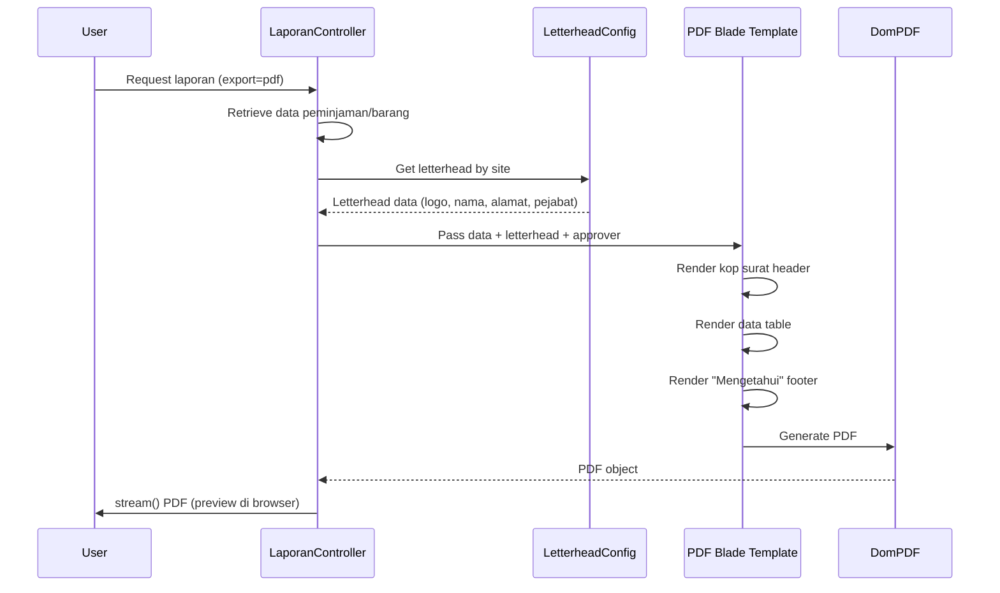

# Design Document: Laporan dengan Kop Surat dan Preview PDF

## Overview

Fitur ini menambahkan kop surat dinamis berdasarkan site/tempat penelitian pada semua laporan PDF, menambahkan bagian "Mengetahui" di footer laporan, dan mengubah behavior dari langsung download menjadi preview di browser terlebih dahulu. Implementasi akan memodifikasi LaporanController dan blade template PDF yang sudah ada.

## Main Algorithm/Workflow



## Core Interfaces/Types

```php
// Config structure untuk kop surat
// File: config/letterhead.php
return [
    'letterheads' => [
        'Site A' => [
            'nama_instansi' => 'PT. Buma - Site A',
            'alamat' => 'Jl. Research Site A No. 123, Kalimantan',
            'telp' => '(0542) 123-4567',
            'email' => 'site-a@buma.co.id',
            'logo_path' => 'images/letterhead/logo-site-a.png',
        ],
        'Site B' => [
            'nama_instansi' => 'PT. Buma - Site B',
            'alamat' => 'Jl. Research Site B No. 456, Kalimantan',
            'telp' => '(0542) 234-5678',
            'email' => 'site-b@buma.co.id',
            'logo_path' => 'images/letterhead/logo-site-b.png',
        ],
        'Site C' => [
            'nama_instansi' => 'PT. Buma - Site C',
            'alamat' => 'Jl. Research Site C No. 789, Kalimantan',
            'telp' => '(0542) 345-6789',
            'email' => 'site-c@buma.co.id',
            'logo_path' => 'images/letterhead/logo-site-c.png',
        ],
    ],
    'approvers' => [
        'Site A' => [
            'nama' => 'Dr. Ahmad Wijaya',
            'jabatan' => 'Kepala Site A',
        ],
        'Site B' => [
            'nama' => 'Ir. Budi Santoso, M.T.',
            'jabatan' => 'Kepala Site B',
        ],
        'Site C' => [
            'nama' => 'Prof. Candra Kusuma',
            'jabatan' => 'Kepala Site C',
        ],
    ],
];

// Model Karyawan (sudah ada, reference)
class Karyawan extends Model
{
    protected $fillable = [
        'nik',
        'nama_karyawan',
        'email',
        'jabatan',
        'departemen',
        'site', // <- Digunakan untuk menentukan kop surat
    ];
}

// Interface untuk Letterhead Service
interface LetterheadServiceInterface
{
    public function getLetterheadBySite(string $site): array;
    public function getApproverBySite(string $site): array;
    public function getDefaultLetterhead(): array;
}
```

## Key Functions with Formal Specifications

### Function 1: getLetterheadBySite()

```php
/**
 * Service untuk mengelola kop surat
 * File: app/Services/LetterheadService.php
 */
class LetterheadService implements LetterheadServiceInterface
{
    public function getLetterheadBySite(string $site): array
    {
        $letterheads = config('letterhead.letterheads');
        
        if (isset($letterheads[$site])) {
            return $letterheads[$site];
        }
        
        return $this->getDefaultLetterhead();
    }
    
    public function getApproverBySite(string $site): array
    {
        $approvers = config('letterhead.approvers');
        
        if (isset($approvers[$site])) {
            return $approvers[$site];
        }
        
        return [
            'nama' => 'Kepala Departemen IT',
            'jabatan' => 'Head of IT Department',
        ];
    }
    
    public function getDefaultLetterhead(): array
    {
        return [
            'nama_instansi' => 'PT. Buma - Head Office',
            'alamat' => 'Jl. Kantor Pusat No. 1, Jakarta',
            'telp' => '(021) 1234-5678',
            'email' => 'info@buma.co.id',
            'logo_path' => 'images/letterhead/logo-default.png',
        ];
    }
}
```

**Preconditions:**
- `$site` is a non-empty string representing site name
- Config file `config/letterhead.php` exists and is properly structured
- Logo image files exist in `public/images/letterhead/` directory

**Postconditions:**
- Returns associative array with letterhead data (nama_instansi, alamat, telp, email, logo_path)
- If site not found in config, returns default letterhead data
- Never returns null or empty array

**Loop Invariants:** N/A (no loops in this function)

---

### Function 2: determineSiteFromData()

```php
/**
 * Helper method untuk menentukan site dari data laporan
 * Di LaporanController atau dalam LetterheadService
 */
protected function determineSiteFromData($data): string
{
    // Untuk laporan peminjaman/pengembalian/terlambat
    if ($data instanceof \Illuminate\Database\Eloquent\Collection && $data->isNotEmpty()) {
        $firstItem = $data->first();
        
        // Cek apakah ini data peminjaman (punya relasi karyawan)
        if (isset($firstItem->karyawan) && $firstItem->karyawan) {
            return $firstItem->karyawan->site ?? 'Head Office';
        }
    }
    
    // Untuk laporan per karyawan (single karyawan object)
    if ($data instanceof \App\Models\Karyawan) {
        return $data->site ?? 'Head Office';
    }
    
    // Default fallback
    return 'Head Office';
}
```

**Preconditions:**
- `$data` can be Collection of Peminjaman objects, single Karyawan object, or Collection of Barang objects
- Related models (karyawan) are loaded via eager loading (with())

**Postconditions:**
- Returns valid site string
- Never returns null or empty string
- Returns 'Head Office' as fallback when site cannot be determined

**Loop Invariants:** N/A

---

### Function 3: Modified Controller Method - peminjaman()

```php
/**
 * Laporan Peminjaman - Modified untuk kop surat dan preview
 * File: app/Http/Controllers/LaporanController.php
 */
public function peminjaman(Request $request)
{
    $data = Peminjaman::with(['barang', 'karyawan'])->latest()->get();
    $judul = "Laporan Riwayat Peminjaman";
    
    if ($request->has('export') && $request->export == 'pdf') {
        // Determine site dari data
        $site = $this->determineSiteFromData($data);
        
        // Get letterhead dan approver
        $letterheadService = app(LetterheadService::class);
        $letterhead = $letterheadService->getLetterheadBySite($site);
        $approver = $letterheadService->getApproverBySite($site);
        
        // Generate PDF dengan data lengkap
        $pdf = Pdf::loadView('laporan.pdf', compact('data', 'judul', 'letterhead', 'approver'));
        
        // UBAH dari download() ke stream() untuk preview
        return $pdf->stream('laporan_peminjaman.pdf');
    }
    
    return view('laporan.hasil', compact('data', 'judul'));
}
```

**Preconditions:**
- Request object is valid
- Database connection is active
- LetterheadService is registered in service container
- Peminjaman, Barang, Karyawan models have proper relationships

**Postconditions:**
- If `export=pdf`, returns StreamedResponse for PDF preview
- If not export, returns HTML view
- PDF contains letterhead header and "Mengetahui" footer
- PDF is displayed in browser (stream), not downloaded

**Loop Invariants:** N/A

---

## Algorithmic Pseudocode

### Main PDF Generation Algorithm

```pascal
ALGORITHM generatePDFWithLetterhead(request, reportType)
INPUT: request (HTTP Request), reportType (String)
OUTPUT: StreamedResponse (PDF preview in browser)

BEGIN
  ASSERT request is not null
  ASSERT reportType IN ['peminjaman', 'pengembalian', 'terlambat', 'stok', 'per_karyawan']
  
  // Step 1: Retrieve report data based on type
  CASE reportType OF
    'peminjaman':
      data ← Peminjaman::with(['barang', 'karyawan'])->latest()->get()
      judul ← "Laporan Riwayat Peminjaman"
    'pengembalian':
      data ← Peminjaman::with(['barang', 'karyawan'])
              ->where('status_peminjaman', 'Kembali')->get()
      judul ← "Laporan Pengembalian"
    'terlambat':
      data ← Peminjaman::with(['barang', 'karyawan'])
              ->where('status_peminjaman', 'Dipinjam')
              ->where('tanggal_kembali_rencana', '<', now())->get()
      judul ← "Laporan Terlambat"
    'stok':
      data ← Barang::all()
      judul ← "Laporan Stok Barang"
    'per_karyawan':
      data ← Peminjaman::with('barang')
              ->where('karyawan_id', request.karyawan_id)->get()
      selectedKaryawan ← Karyawan::find(request.karyawan_id)
      judul ← "Laporan Peminjaman: " + selectedKaryawan.nama_karyawan
  END CASE
  
  ASSERT data is not null
  
  // Step 2: Determine site from data
  site ← determineSiteFromData(data)
  
  // Step 3: Get letterhead configuration
  letterheadService ← app(LetterheadService::class)
  letterhead ← letterheadService.getLetterheadBySite(site)
  approver ← letterheadService.getApproverBySite(site)
  
  ASSERT letterhead contains required keys [nama_instansi, alamat, telp, email, logo_path]
  ASSERT approver contains required keys [nama, jabatan]
  
  // Step 4: Generate PDF with all data
  pdf ← Pdf::loadView('laporan.pdf', [
    'data' => data,
    'judul' => judul,
    'letterhead' => letterhead,
    'approver' => approver
  ])
  
  // Step 5: Stream PDF (preview in browser) instead of download
  RETURN pdf.stream('laporan_' + reportType + '.pdf')
END
```

**Preconditions:**
- Request parameter is valid HTTP Request object
- reportType is one of the valid report types
- Database models are properly configured with relationships
- LetterheadService is available in service container
- Blade view 'laporan.pdf' exists

**Postconditions:**
- Returns StreamedResponse containing PDF
- PDF opens in browser tab (preview mode)
- PDF contains complete letterhead header
- PDF contains "Mengetahui" section in footer
- Original data structure preserved throughout processing

**Loop Invariants:** N/A (algorithm uses conditional branching, not loops)

---

### Site Determination Algorithm

```pascal
ALGORITHM determineSiteFromData(data)
INPUT: data (Collection of models or single model)
OUTPUT: site (String)

BEGIN
  // Check if data is non-empty collection
  IF data IS Collection AND data.isNotEmpty() THEN
    firstItem ← data.first()
    
    // Check if item has karyawan relationship
    IF firstItem HAS PROPERTY 'karyawan' AND firstItem.karyawan IS NOT NULL THEN
      IF firstItem.karyawan HAS PROPERTY 'site' AND firstItem.karyawan.site IS NOT NULL THEN
        RETURN firstItem.karyawan.site
      END IF
    END IF
  END IF
  
  // Check if data is single Karyawan object
  IF data IS INSTANCE OF Karyawan THEN
    IF data HAS PROPERTY 'site' AND data.site IS NOT NULL THEN
      RETURN data.site
    END IF
  END IF
  
  // Fallback to default
  RETURN 'Head Office'
END
```

**Preconditions:**
- data parameter is provided (may be Collection, Model instance, or null)
- If Collection, items have proper model structure
- Karyawan relationship is eager-loaded when needed

**Postconditions:**
- Always returns a valid non-empty string
- Returns actual site from first item if available
- Returns 'Head Office' as safe fallback
- Never returns null or empty string

**Loop Invariants:** 
- Only examines first item of collection (no iteration needed)
- All checked properties are validated before access

---

## Example Usage

### Example 1: Generating PDF with Letterhead

```php
// User clicks "Export PDF" button dari halaman laporan peminjaman
// Route: GET /laporan/peminjaman?export=pdf

// Di LaporanController:
public function peminjaman(Request $request)
{
    $data = Peminjaman::with(['barang', 'karyawan'])->latest()->get();
    $judul = "Laporan Riwayat Peminjaman";
    
    if ($request->has('export') && $request->export == 'pdf') {
        // Determine site
        $site = $this->determineSiteFromData($data);
        // $site = "Site A"
        
        // Get letterhead
        $letterheadService = app(LetterheadService::class);
        $letterhead = $letterheadService->getLetterheadBySite($site);
        // $letterhead = [
        //     'nama_instansi' => 'PT. Buma - Site A',
        //     'alamat' => 'Jl. Research Site A No. 123',
        //     ...
        // ]
        
        $approver = $letterheadService->getApproverBySite($site);
        // $approver = [
        //     'nama' => 'Dr. Ahmad Wijaya',
        //     'jabatan' => 'Kepala Site A'
        // ]
        
        $pdf = Pdf::loadView('laporan.pdf', compact('data', 'judul', 'letterhead', 'approver'));
        
        // Preview di browser (bukan download)
        return $pdf->stream('laporan_peminjaman.pdf');
    }
    
    return view('laporan.hasil', compact('data', 'judul'));
}
```

### Example 2: Blade Template dengan Kop Surat

```blade
{{-- resources/views/laporan/pdf.blade.php --}}
<!DOCTYPE html>
<html>
<head>
    <title>{{ $judul }}</title>
    <style>
        body { font-family: 'Arial', sans-serif; margin: 20px; }
        
        /* Kop Surat Styling */
        .letterhead {
            border-bottom: 3px solid #000;
            padding-bottom: 10px;
            margin-bottom: 20px;
            text-align: center;
        }
        .letterhead img { height: 60px; margin-bottom: 5px; }
        .letterhead h2 { margin: 5px 0; font-size: 18px; }
        .letterhead p { margin: 2px 0; font-size: 11px; }
        
        /* Table Styling */
        table { width: 100%; border-collapse: collapse; margin-top: 15px; }
        th, td { border: 1px solid #000; padding: 8px; font-size: 11px; text-align: left; }
        th { background-color: #e0e0e0; font-weight: bold; }
        
        /* Footer "Mengetahui" Styling */
        .approval-section {
            margin-top: 40px;
            text-align: right;
            padding-right: 50px;
        }
        .approval-section p { margin: 5px 0; }
        .signature-space { height: 60px; }
        .approver-name { font-weight: bold; text-decoration: underline; }
    </style>
</head>
<body>
    {{-- KOP SURAT HEADER --}}
    <div class="letterhead">
        @if(isset($letterhead['logo_path']) && file_exists(public_path($letterhead['logo_path'])))
            
        @endif
        <h2>{{ $letterhead['nama_instansi'] ?? 'PT. Buma' }}</h2>
        <p>{{ $letterhead['alamat'] ?? '' }}</p>
        <p>Telp: {{ $letterhead['telp'] ?? '' }} | Email: {{ $letterhead['email'] ?? '' }}</p>
    </div>
    
    {{-- JUDUL LAPORAN --}}
    <h3 style="text-align: center; margin: 20px 0;">{{ $judul }}</h3>
    <p style="font-size: 11px;">Tanggal Cetak: {{ \Carbon\Carbon::now()->format('d F Y') }}</p>
    
    {{-- TABEL DATA --}}
    <table>
        <thead>
            <tr>
                <th>No</th>
                @if(isset($data[0]->stok))
                    <th>Kode Barang</th>
                    <th>Nama Barang</th>
                    <th>Stok</th>
                @else
                    <th>Barang</th>
                    <th>Peminjam</th>
                    <th>Tanggal Pinjam</th>
                    <th>Status</th>
                @endif
            </tr>
        </thead>
        <tbody>
            @foreach($data as $index => $row)
            <tr>
                <td>{{ $index + 1 }}</td>
                @if(isset($row->stok))
                    <td>{{ $row->kode_barang }}</td>
                    <td>{{ $row->nama_barang }}</td>
                    <td>{{ $row->stok }}</td>
                @else
                    <td>{{ $row->barang->nama_barang ?? '-' }}</td>
                    <td>{{ $row->karyawan->nama_karyawan ?? '-' }}</td>
                    <td>{{ \Carbon\Carbon::parse($row->tanggal_pinjam)->format('d-m-Y') }}</td>
                    <td>{{ $row->status_peminjaman }}</td>
                @endif
            </tr>
            @endforeach
        </tbody>
    </table>
    
    {{-- BAGIAN "MENGETAHUI" FOOTER --}}
    <div class="approval-section">
        <p>Mengetahui,</p>
        <p>{{ $approver['jabatan'] ?? 'Kepala Departemen' }}</p>
        <div class="signature-space"></div>
        <p class="approver-name">{{ $approver['nama'] ?? '' }}</p>
    </div>
</body>
</html>
```

### Example 3: Using Letterhead Service

```php
// Di controller atau service lain yang butuh letterhead
$letterheadService = app(LetterheadService::class);

// Get letterhead untuk Site A
$letterheadA = $letterheadService->getLetterheadBySite('Site A');
// Returns: ['nama_instansi' => 'PT. Buma - Site A', ...]

// Get letterhead untuk site yang tidak terdaftar
$letterheadUnknown = $letterheadService->getLetterheadBySite('Site XYZ');
// Returns: default letterhead (Head Office)

// Get approver untuk Site B
$approverB = $letterheadService->getApproverBySite('Site B');
// Returns: ['nama' => 'Ir. Budi Santoso, M.T.', 'jabatan' => 'Kepala Site B']
```

### Example 4: Browser Behavior Comparison

```php
// SEBELUM (Download langsung):
return $pdf->download('laporan_peminjaman.pdf');
// Behavior: Browser langsung download file, save dialog muncul

// SESUDAH (Preview dulu):
return $pdf->stream('laporan_peminjaman.pdf');
// Behavior: PDF terbuka di tab browser baru, user bisa preview dulu
// User bisa klik tombol download di PDF viewer jika ingin save
```

---

## Correctness Properties

### Property 1: Letterhead Consistency
```php
∀ report ∈ ReportTypes, ∀ data ∈ ReportData:
  site = determineSiteFromData(data) ⟹
  letterhead = getLetterheadBySite(site) ∧
  letterhead ≠ null ∧
  letterhead.contains(['nama_instansi', 'alamat', 'telp', 'email', 'logo_path'])
```

**Assertion**: Every report must have valid letterhead data, never null or incomplete.

### Property 2: Stream vs Download
```php
∀ pdfRequest ∈ PDFRequests:
  response = controller.generatePDF(pdfRequest) ⟹
  response.type == StreamedResponse ∧
  response.headers['Content-Disposition'] contains 'inline' (not 'attachment')
```

**Assertion**: All PDF reports must use `stream()` method, opening in browser (inline), not downloading (attachment).

### Property 3: Approver Presence
```php
∀ pdf ∈ GeneratedPDFs:
  pdf.contains('Mengetahui') ∧
  pdf.contains(approver.nama) ∧
  pdf.contains(approver.jabatan)
```

**Assertion**: Every generated PDF must contain "Mengetahui" section with valid approver name and position.

### Property 4: Site Fallback Safety
```php
∀ data ∈ ReportData:
  site = determineSiteFromData(data) ⟹
  site ∈ ConfiguredSites ∨ site == 'Head Office'
```

**Assertion**: Site determination always returns valid configured site or safe default 'Head Office'.

### Property 5: All Report Types Updated
```php
let reportMethods = ['peminjaman', 'pengembalian', 'terlambat', 'stok', 'perKaryawan']
∀ method ∈ reportMethods:
  method.pdfGeneration uses stream() ∧
  method.pdfGeneration includes letterhead ∧
  method.pdfGeneration includes approver
```

**Assertion**: All 5 report methods must be consistently updated with letterhead, approver, and stream behavior.

---

## Correctness Properties sebagai Test Assertions

```php
// Property Test: Letterhead harus selalu valid
public function test_letterhead_always_valid_for_any_site()
{
    $service = new LetterheadService();
    $sites = ['Site A', 'Site B', 'Site C', 'Unknown Site', '', null];
    
    foreach ($sites as $site) {
        $letterhead = $service->getLetterheadBySite($site ?? '');
        
        $this->assertIsArray($letterhead);
        $this->assertArrayHasKey('nama_instansi', $letterhead);
        $this->assertArrayHasKey('alamat', $letterhead);
        $this->assertArrayHasKey('telp', $letterhead);
        $this->assertArrayHasKey('email', $letterhead);
        $this->assertArrayHasKey('logo_path', $letterhead);
        $this->assertNotEmpty($letterhead['nama_instansi']);
    }
}

// Property Test: PDF harus stream, bukan download
public function test_all_pdf_reports_use_stream_not_download()
{
    $reportRoutes = [
        '/laporan/peminjaman?export=pdf',
        '/laporan/pengembalian?export=pdf',
        '/laporan/terlambat?export=pdf',
        '/laporan/stok?export=pdf',
    ];
    
    foreach ($reportRoutes as $route) {
        $response = $this->get($route);
        
        $response->assertStatus(200);
        // Pastikan response adalah StreamedResponse
        $this->assertInstanceOf(\Symfony\Component\HttpFoundation\StreamedResponse::class, $response->baseResponse);
        
        // Pastikan Content-Disposition adalah 'inline' (stream), bukan 'attachment' (download)
        $disposition = $response->headers->get('Content-Disposition');
        $this->assertStringContainsString('inline', $disposition);
        $this->assertStringNotContainsString('attachment', $disposition);
    }
}

// Property Test: Approver selalu ada
public function test_approver_always_present_in_pdf()
{
    $service = new LetterheadService();
    $sites = ['Site A', 'Site B', 'Site C', 'Unknown Site'];
    
    foreach ($sites as $site) {
        $approver = $service->getApproverBySite($site);
        
        $this->assertIsArray($approver);
        $this->assertArrayHasKey('nama', $approver);
        $this->assertArrayHasKey('jabatan', $approver);
        $this->assertNotEmpty($approver['nama']);
        $this->assertNotEmpty($approver['jabatan']);
    }
}
```
