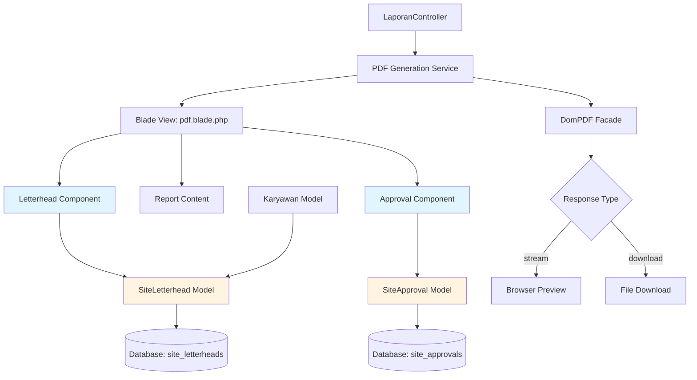
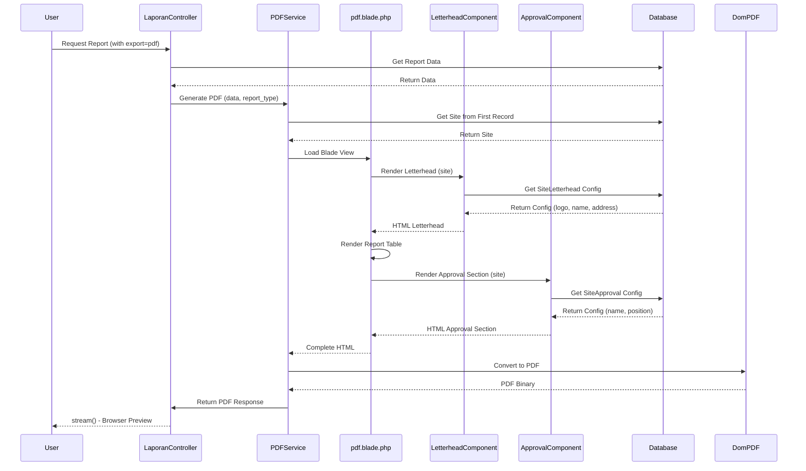

# Design Document: laporan-kop-surat-preview

## Overview

This feature enhances the Laravel IT Asset Management report system with three key capabilities: (1) dynamic PDF letterheads per research site, (2) approval sections showing acknowledging officials, and (3) browser-based PDF preview before download. The system currently uses dompdf via Barryvdh\DomPDF package to generate five report types (peminjaman, pengembalian, terlambat, stok, per karyawan), all using direct download. This enhancement will add site-specific branding through database-driven letterhead configuration, formal approval documentation, and improved user experience through inline PDF viewing.

The implementation leverages Laravel's existing architecture with minimal changes to core controller logic, focusing on view layer enhancements and new database models for letterhead and approval configuration. All reports will use the same letterhead and approval components, ensuring consistency across the system.

## Architecture



## Main Workflow Sequence



## Components and Interfaces

### Component 1: SiteLetterhead Model

**Purpose**: Manages letterhead configuration per research site including logo, institution name, and address.

**Interface**:
```php
class SiteLetterhead extends Model
{
    protected $fillable = ['site', 'logo_path', 'institution_name', 'address'];
    
    public function getLogoUrl(): ?string;
    public static function getBySite(string $site): ?SiteLetterhead;
}
```

**Responsibilities**:
- Store and retrieve site-specific letterhead configuration
- Provide logo URL resolution for PDF rendering
- Handle default/fallback letterhead when site not configured

### Component 2: SiteApproval Model

**Purpose**: Manages approval official information per research site.

**Interface**:
```php
class SiteApproval extends Model
{
    protected $fillable = ['site', 'approver_name', 'approver_position'];
    
    public static function getBySite(string $site): ?SiteApproval;
}
```

**Responsibilities**:
- Store and retrieve site-specific approval official data
- Provide approver name and position for "Mengetahui" section


### Component 3: LaporanController (Enhanced)

**Purpose**: Handles HTTP requests for report generation with preview/download options.

**Interface**:
```php
class LaporanController extends Controller
{
    public function peminjaman(Request $request): Response;
    public function pengembalian(Request $request): Response;
    public function terlambat(Request $request): Response;
    public function stok(Request $request): Response;
    public function perKaryawan(Request $request): Response;
    
    private function generatePdf($data, string $judul, ?string $site): Response;
}
```

**Responsibilities**:
- Process report requests and filter data
- Determine site context from data
- Call PDF generation with site parameter
- Return stream() response for preview (default) or download() when requested

### Component 4: PDF View Template (pdf.blade.php)

**Purpose**: Main PDF template that composes letterhead, content, and approval sections.

**Interface** (Blade template variables):
```php
// Expected variables passed to view
$judul     // Report title
$data      // Report data collection
$site      // Site identifier for letterhead/approval lookup
```

**Responsibilities**:
- Render complete PDF document structure
- Include letterhead component at top
- Display report table with dynamic columns
- Include approval section at bottom


### Component 5: LetterheadComponent (Blade Partial)

**Purpose**: Reusable blade partial for rendering site-specific letterhead.

**Interface** (Blade component):
```php
// Component props
$site  // Site identifier string
```

**Responsibilities**:
- Query SiteLetterhead model by site
- Render logo image (base64 encoded for PDF)
- Display institution name and address
- Provide fallback styling when no letterhead configured

### Component 6: ApprovalComponent (Blade Partial)

**Purpose**: Reusable blade partial for rendering approval section.

**Interface** (Blade component):
```php
// Component props
$site  // Site identifier string
```

**Responsibilities**:
- Query SiteApproval model by site
- Render "Mengetahui" section with approver details
- Provide signature placeholder spacing
- Handle missing approval configuration gracefully

## Data Models

### Model 1: SiteLetterhead

```php
// Database table: site_letterheads
Schema::create('site_letterheads', function (Blueprint $table) {
    $table->id();
    $table->string('site')->unique();
    $table->string('logo_path')->nullable();
    $table->string('institution_name');
    $table->text('address');
    $table->timestamps();
});
```

**Validation Rules**:
- `site`: Required, unique, max 255 characters
- `logo_path`: Optional, must be valid file path in storage
- `institution_name`: Required, max 255 characters
- `address`: Required, text field for multi-line addresses
